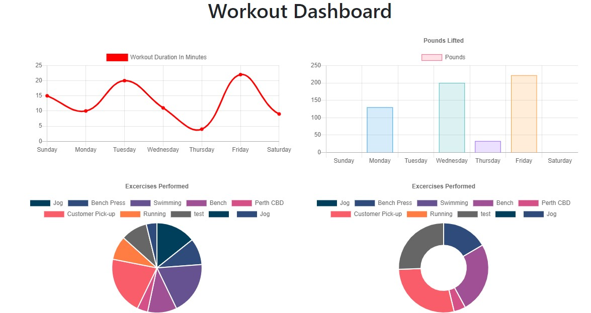
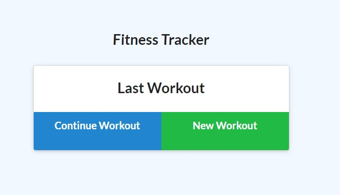

# Workout Tracker&middot;  

## Deployment Site

https://radiant-refuge-26002.herokuapp.com/

https://github.com/ChrisAMK/Workout-Tracker

## Description 
For this weeks homework we were tasked with completing the backend code to be able to enter and retreive workout entries in the mongoose database, we were provided with the front end code so that we only had to work with mongoose. The aim was to have the user land on the homepage and be presented with the information of the previous workout and be given the option to add exercises to the workout or create a new workout entirely, the user can click on the tracker page to view the weekly stats. The main learning points of this project were creating a mongoose schema

## Table of Contents 
* [Installation](#Installation)
* [Usage](#Usage)
* [License](#License)
* [Contributions](#Contributions)
* [Tests and Examples](#Tests)
* [Questions](#Questions)

## Installation  
No Installation Required, just click on the deployment link pprovided above

## Usage  
For users to enter their workout details and be presented graphically with their progress

## License  
Academic Free License v3.0

[Click Here to go to License Site!](https://opensource.org/licenses/AFL-3.0)

## Tests and Examples  
Enter each excersise of your workout, once all are etered complete the excersise and navigate to the stats page to see your progress

## Questions  
If there are any questions feel free to reach me at [Github](https://github.com/ChrisAMK)

or E-mail me at chriskl@live.com

